## Bonding Curve Equations

The pricing mechanism is based on a constant product formula similar to Uniswap but with virtual reserves:

```
K = virtualEthReserve * virtualTokenReserve
```

Where K is a constant value that doesn't change after initialization.

### Virtual Reserves Calculation

The virtual reserves are calculated as follows:

```
virtualTokenReserve = (2 * lotteryPool * 1e18) / (initialTokenPrice - (lotteryPool * 1e18 / migrated_supply))
virtualEthReserve = (constant_k * 1e18) / virtualTokenReserve
```

### Price Calculation

The token price at any point is:

```
currentPrice = (virtualEthReserve * 1e18) / virtualTokenReserve
```

### Buy Calculation

When buying tokens with ETH, the amount of tokens received is:

```
tokensToTransfer = virtualTokenReserve - (constant_k * 1e18) / (virtualEthReserve + (ethAmount * SCALE_FACTOR / SCALE_DENOMINATOR))
```

### Sell Calculation

When selling tokens for ETH, the amount of ETH received is:

```
ethToReturn = virtualEthReserve - (constant_k * 1e18) / (virtualTokenReserve + (tokenAmount * SCALE_FACTOR / SCALE_DENOMINATOR))
```

## Visual Representations

### Bonding Curve Pricing


### Virtual Reserves Mechanism


### Buy/Sell Flow


### Price Curve Visualization

```mermaid
xychart-beta
    title "Token Price vs. Token Supply in Pool"
    x-axis "Token Supply in Pool (Decreasing →)"
    y-axis "Price per Token (ETH)"
    line [0.3, 0.4, 0.5, 0.6, 0.8, 1.0, 1.3, 1.6, 2.0, 2.4, 3.0, 4.0, 5.0, 6.5, 8.0, 10.0]
```



## Lottery Pool Influence

The lottery pool is a key component that influences the pricing mechanism:


## Usage

### Buying Tokens

Send ETH to the contract's buy function to receive tokens based on the current bonding curve price:
```solidity
// Minimum purchase: 0.01 ETH
function buy() public payable
```

### Selling Tokens

Call the sell function with the amount of tokens to sell:
```solidity
function sell(uint256 tokenAmount) public
```

### Adding to Lottery Pool

Increase the lottery pool and modify the bonding curve:
```solidity
function addToLotteryPool() external payable
```

## Technical Implementation

The contract uses OpenZeppelin's ERC20 implementation with custom logic for the bonding curve mathematics. The virtual reserves and constant product formula K ensure a predictable price curve without requiring massive initial capital.

## Mathematical Models

### Initial Setup

1. Start with initial parameters: `initialTokenPrice`, `lotteryPool`, `migrated_supply`
2. Calculate virtual token reserve using the formula
3. Calculate virtual ETH reserve to establish desired starting price
4. Set constant K as the product of the two reserves

### Trading Impact

Each buy or sell transaction:
1. Applies a 96% scaling factor to create slippage
2. Updates virtual reserves according to the constant product formula
3. Updates actual token balances
4. Maintains the mathematical integrity of the price curve

## Limitations

- Maximum lottery pool size: 10,000 ETH
- Minimum purchase: 0.01 ETH
- Maximum buy: Limited to 10% of remaining lottery pool
